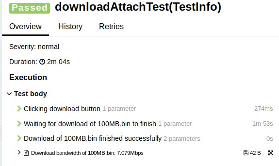
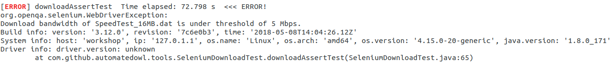

# selenium-download-kpi

Selenium extension for Java which provides KPIs of file downloads.
Currently, the library supports Chromedriver. it would allow you:

* To define your download folder both globally and locally in one code line.
* Given a file name, web element and timeout, you would be able to download a file and verify succession. 
* Logging the download bandwidth in Mbps and attaching it to Allure report.
* Assertion of download bandwidth, where you define a numeric threshold for passing/failing the test.  

### Setting up your test

To easily define your download folder, use create a new instance of SeleniumDownloadKPI object, 
with the download folder supplied as String parameter.
Then, before initializing your Chromedriver object, use generateDownloadFolderCapability() 
method to get ChromeOptions object which contains your download folder, and pass it to Chromedriver constructor.

```
    private SeleniumDownloadKPI seleniumDownloadKPI;

    @BeforeEach
    void setUpTest() {
        seleniumDownloadKPI =
             new SeleniumDownloadKPI("/tmp/downloads");
        ChromeOptions chromeOptions =
                seleniumDownloadKPI.generateDownloadFolderCapability();
        driver = new ChromeDriver(chromeOptions);
```

### Example of file download with bandwidth attachment:

The method fileDownloadKPI() receives two parameters:

WebElement object: adamInternetPage.getFileDownloadLink() returns a WebElement of download link.

String object: "SpeedTest_16MB.dat" describes the file name which intended to be downloaded.

The method would perform a download using a default timeout of five minutes, and would also throw an exception in case of unsuccessful download.

```
    @Test
    void downloadAttachTest() throws InterruptedException {
        adamInternetPage.navigateToPage(driver);
        seleniumDownloadKPI.fileDownloadKPI(
                adamInternetPage.getFileDownloadLink(), "SpeedTest_16MB.dat");
        waitBeforeClosingBrowser();
    }
```

### Example of file download with bandwidth attachment (custom timeout):

Another variation of fileDownloadKPI() method.
The method would act exactly the same as described above, just with a custom download timeout of one minute passed as third argument (in milliseconds).

```
    void downloadAttachCustomTimeoutTest() throws InterruptedException {
        adamInternetPage.navigateToPage(driver);
        seleniumDownloadKPI.fileDownloadKPI(
                adamInternetPage.getFileDownloadLink(),
                "SpeedTest_16MB.dat", 60000);
        waitBeforeClosingBrowser();
```

### Example of file download with attachment and assertion:

The method fileDownloadAssertKPI() receives three parameters:

WebElement object: adamInternetPage.getFileDownloadLink() returns WebElement of download link.

String object: "SpeedTest_16MB.dat" describes the file name which intended to be downloaded.

Long value '5' is the Mbps threshold for the file download. If the download bandwidth would be less than 5Mbps, exception would be thrown.

It also uses a default download timeout of five minutes. 

```
    @Test
    void downloadAssertTest() throws InterruptedException {
        adamInternetPage.navigateToPage(driver);
        seleniumDownloadKPI.fileDownloadAssertKPI(
                adamInternetPage.getFileDownloadLink(),
                "SpeedTest_16MB.dat", 5);
        waitBeforeClosingBrowser();
    }
```

### Example of file download with attachment and assertion (custom timeout):

Another variation of fileDownloadAssertKPI() method.
The method would act exactly the same as described above, just with a custom download timeout of one minute passed as fourth argument (in milliseconds).

```
    @Test
    void downloadAssertTest() throws InterruptedException {
        adamInternetPage.navigateToPage(driver);
        seleniumDownloadKPI.fileDownloadAssertKPI(
                 adamInternetPage.getFileDownloadLink(),
                 "SpeedTest_16MB.dat", 5, CUSTOM_DOWNLOAD_TIMEOUT);
        waitBeforeClosingBrowser();
    }
```

### Sanpshot of file download with bandwidth attachment in Allure report:


### Sanpshot of bandwidth exception:


### Sanpshot of bandwidth logging:


